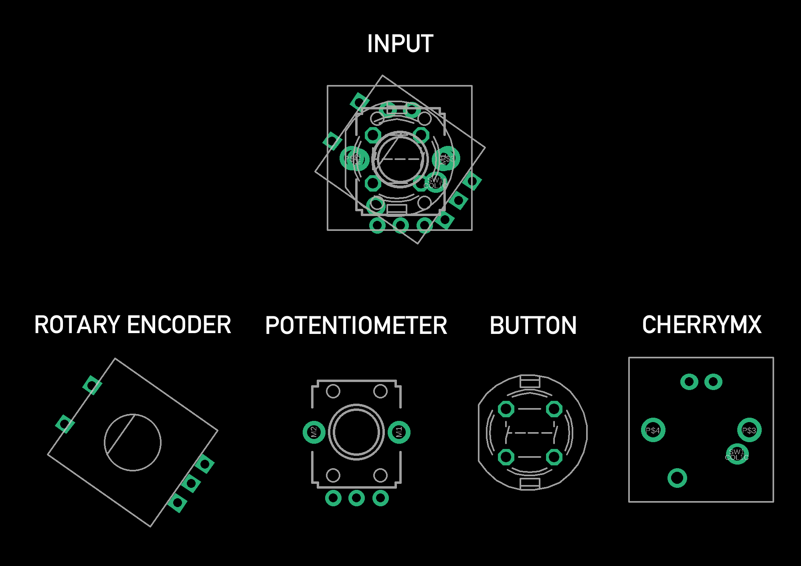
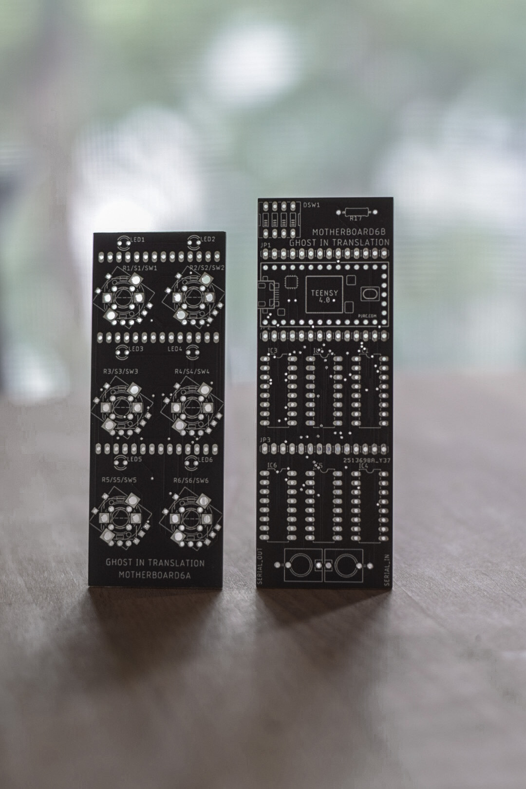
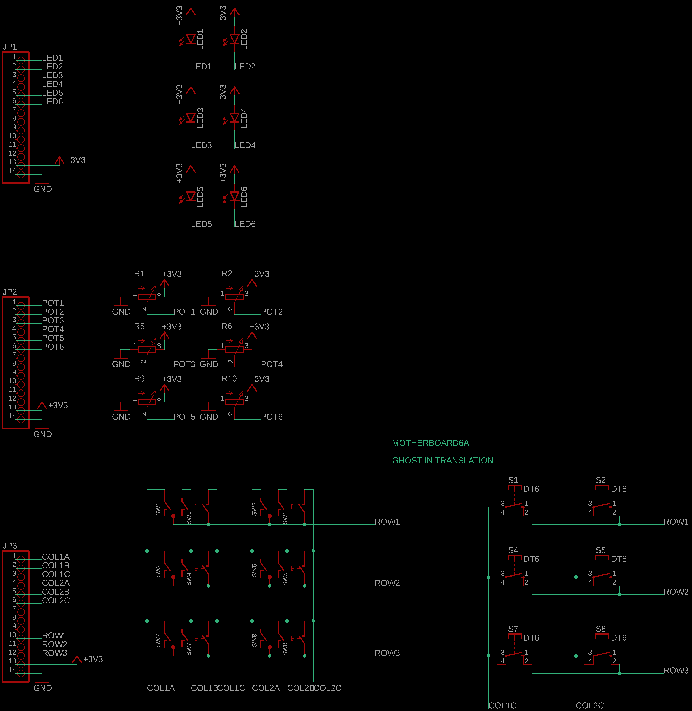
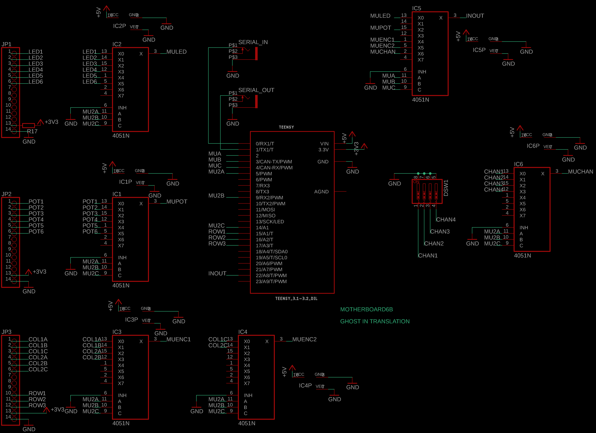

# MOTHERBOARD6


## MOdular Teensy Hybrid Eurorack Board

MOTHERBOARD6 is a 6 controls Teensy 4.0 + audio board platform. It is part of a familly of 3 variations of the same platform, MOTHERBOARD6, MOTHERBOARD9 and MOTHERBOARD12.

The MOTHERBOARDs follow a column design of 3 inputs per column and 2, 3 or 4 columns for a total of 6, 9 or 12 inputs and as many LEDs. 

What makes it interesting is how the inputs are stacked to allow for any combination of pushbuttons, potentiometers, encoders and CherryMX. The footprints of those 4 type of inputs are stacked together so that each spot can be any of them, and only one pcb can be used for many different modules. It is a modular platform.



It is hybrid because the physical format is following Eurorack standard, but it doesn't use CV/Gates and patch cables and has rather midi and audio jacks in the back. They are oriented for live performance more than experimentation.

A MOTHERBOARD come with 2 boards, one on which the inputs and leds are soldered to (A), and one on which the Teensy and other components are soldered to (B). Both boards are attached together by multiple pin headers.

I sell the PCBs if you wish to build it. You can get them here: https://ghostintranslation.bandcamp.com/merch/motherboard6-pcb-3



## Schematics

Due to the use of the audio board, the available pins are very limited. Looking at the Teensy audio board page (https://www.pjrc.com/store/teensy3_audio.html) we can see only pins 0, 1, 2, 3, 4, 5, 9, 14, 16, 17, 22 are available. Also looking at Teensy pins (https://www.pjrc.com/store/teensy40.html), only 14, 16 and 17 from this subset are analog inputs.

So the use of multiplexers is required to be able to read pushbuttons, potentiometers, encoders or to lit leds. In addition, a matrix design is used for the encoders to reduce the number of inputs required as each of them has 3 inputs.

On this design, pin 22 will switch from input to output very fast to lit the leds and read the inputs.

 

### Notes

Dependng on the type of inputs used, not all multiplexers may be required. 

- IC1 = Mux for potentiometers
- IC2 = Mux for LEDs
- IC3 = Mux for encoders
- IC4 = Mux for encoder's switches and pushbuttons
- IC5 = Main mux, always required
- IC6 = Mux for midi channel dipswitch

A few examples:

If you only use potentiometers, you won't need IC3 and IC4. Or if you don't have any led you won't need IC2. Or if you don't want to use a dipswitch to select the midi channel, you won't need IC6.

## Components

Here is the list of components you will need:
- MOTHERBOARD6A pcb
- MOTHERBOARD6B pcb
- Teensy 4.0
    - PJRC: https://www.pjrc.com/store/teensy40.html
    - DigiKey: https://www.digikey.ca/en/products/detail/sparkfun-electronics/DEV-15583/10384551
- 14 pins male headers, or longer and can be cut to length
    - DigiKey: https://www.digikey.ca/en/products/detail/adam-tech/PH1-14-UA/9830506
    - DigiKey: https://www.digikey.ca/en/products/detail/PREC040SAAN-RC/S1012EC-40-ND/2774814
- 14 pins female headers, or longer and can be cut to length
    - DigiKey: https://www.digikey.ca/en/products/detail/sullins-connector-solutions/PPTC141LFBN-RC/810152
    - DigiKey: https://www.digikey.ca/en/products/detail/chip-quik-inc/HDR100IMP40F-G-V-TH/5978200
- 1x 5 pins female header
- CD4051 multiplexers (number varies)
    - DigiKey: https://www.digikey.ca/en/products/detail/texas-instruments/CD4051BE/67305
- DIP16 IC sockets (number varies)
    - DigiKey: https://www.digikey.ca/en/products/detail/adam-tech/ICS-316-T/9832862
- 3.5mm jack connectors
    - Thonk: https://www.thonk.co.uk/shop/3-5mm-jacks/ (the Thonkiconn)
- 4 positions dipswitch
    - DigiKey: https://www.digikey.ca/product-detail/en/cts-electrocomponents/210-4MS/CT2104MS-ND/2503781

And here is the list of optional components according to your wants:

- Teensy audio board
    - PJRC: https://www.pjrc.com/store/teensy3_audio.html
- Vertical linear 10k potentiometers
    - Modular Addict: https://modularaddict.com/parts/potentiometers-1/9mm-t18-vertical-potentiometers
    - Synthrotek: https://store.synthrotek.com/9mm-Vertical-Potentiometers_p_649.html
    - Thonk: https://www.thonk.co.uk/shop/alpha-9mm-pots-vertical-t18/
    - DigiKey: https://www.digikey.ca/en/products/detail/tt-electronics-bi/P0915N-FC15BR10K/4780740
- D6 pushbuttons
    - Thonk: https://www.thonk.co.uk/shop/radio-music-switch/
    - DigiKey: https://www.digikey.ca/en/products/detail/c-k/D6R00-F1-LFS/1466329
- Rotary encoders
    - DigiKey: https://www.digikey.ca/en/products/detail/bourns-inc/PEC11R-4115K-S0018/4699207
- 1 resistor ~ 22ohm
- LEDs
    - Thonk: https://www.thonk.co.uk/shop/new-style-flat-top-leds-turing-pulses-vactrol-mix/
    - DigiKey: https://www.digikey.ca/en/products/detail/WP424SRDT/754-1717-ND/3084140

## Teensy

In order to run any sketch on the Teensy you have to install Arduino and the Teensyduino add-on.
Follow the instructions from the official page:
https://www.pjrc.com/teensy/teensyduino.html

1. Then open `Synth.ino` located in the `Synth` folder of this repo.
2. In the Tools -> USB Type menu, choose `Serial + midi`.
3. Plug the Teensy to your computer with a micro USB cable. (It's ok if the Teensy is on the module)
4. Then just click the arrow button to upload the code

## MIDI

The MIDI input and output jacks are directly connected to the Teensy serial input and output. That means there is no protection against voltage or current. It is primarily ment to connect 2 of these modules, or 2 Teensy together. If you want to connect something else to it make sure to provide a maximum of `3.3v` and `250mA`.

## How to code

Copy the `Motherboard6.h` in your project. Then just include it and start using it.

### Init

Motherboard6 is a singleton, so to instanciate it you do this:
```
Motherboard6 * motherboard = Motherboard6::getInstance();
```

Then in the `Setup` you have to call the Motherboard's `init` with the type of controls you have on the board:
```
// 0 = empty, 1 = button, 2 = potentiometer, 3 = encoder
byte controls[6] = {2,2, 2,2, 2,2}; // From left to right and top to bottom
motherboard->init(controls);
```

Then in the `loop` you have to call the Motherboard's `update`:
```
motherboard->update();
```

### LEDs

LEDs are controlled by setting their status according to:

- 0 = Off
- 1 = Solid
- 2 = Slow flashing
- 3 = Fast flashing
- 4 = Solid for 50 milliseconds
- 5 = Solid low birghtness

#### Set one LED:
```
void setLED(byte ledIndex, byte ledStatus);
```

#### Set multiple LEDs:
The first parameter called `binary` is a number that will be represented in binary with the least significant bit on the left. Ex: 9 = 100100 => LEDs of indexes 0 and 3 will be lit.
```
void setAllLED(unsigned int binary, byte ledStatus);
```

#### Toggle an LEDs:
```
void toggleLED(byte index);
```

#### Reset all LEDs:
```
void resetAllLED();
```

### Inputs

#### Get one input value:
- In the case of a potentiometer it will return between 0 and 1023.
- In the case of a button it will return 1 for push 0 for release.
- In the case of a rotary it will return the number of rotations since the last get.
```
int getInput(byte index);
```

#### Get the switch value of an encoder:

Because an encoder is like 2 controls, the rotary and the switch, we need this function in addition to `getInput`.
```
int getEncoderSwitch(byte index);
```

#### Get the maximum possible value of the potentiometers:
The value depends of the ADC resolution, which is 10 by default and can be set to 12 or 8.

With a resolution of 10 bits, the maximum value is 1023.
```
int getAnalogMaxValue();
```

#### Get the minimum possible value of the potentiometers:
It should always be 0, but if your potentiometers are not that accurate they could return bigger than 0 as a minimum value. You could then change the return value of that function to match the real minimum. This will ensure that `getInput` always returns a minimum of 0 and a maximum of 1023 that corresponds to the actual min and max. 
```
int getAnalogMinValue();
```

#### Get the midi channel
This is set by the dipswitch and read only once when powered on. If no dipswtich is soldered then the channel will be 1.
```
byte getMidiChannel();
```

### Callbacks
Callbacks are a very good way of handling inputs. Using them instead of reading `getInput` in the loop will make your code easier to read and maintain.

#### Press
This will be triggered only once on release.

Can be used for a button and for a rotary switch.

`fptr` is a void() function.
```
void setHandlePress(byte inputIndex, PressCallback fptr);
```

#### Long Press
This will be triggered only once on release after a long press. If an input has both Press and Long Press callbacks then only one of them will be triggered according to the duration of the press.

`fptr` is a void() function.
```
void setHandleLongPress(byte inputIndex, LongPressCallback fptr);
```

#### Rotary Change
This will be triggered once every time a turn is detected.

`fptr` is a void(bool value) function. `value` is either 0 for a left rotation or 1 for a right rotation.

```
void setHandleRotaryChange(byte inputIndex, RotaryChangeCallback fptr);
```

## Design rules

Here are the dimensions for any module size. Every column is following the same rules. So the size of a module depends on the number of column. 2 columns = 2x20mm = 40mm, 3 columns = 3x20 = 60mm ...


## Known issues
- Encoders are skipping turns sometimes
- Maybe test with faster multiplexers

## License

This project is licensed under the MIT License - see the [LICENSE.md](LICENSE.md) file for details

# About me
You can find me on Bandcamp, Instagram and Youtube, as well as my own website:

https://ghostintranslation.bandcamp.com/

https://www.instagram.com/ghostintranslation/

https://www.youtube.com/channel/UCcyUTGTM-hGLIz4194Inxyw

https://www.ghostintranslation.com/