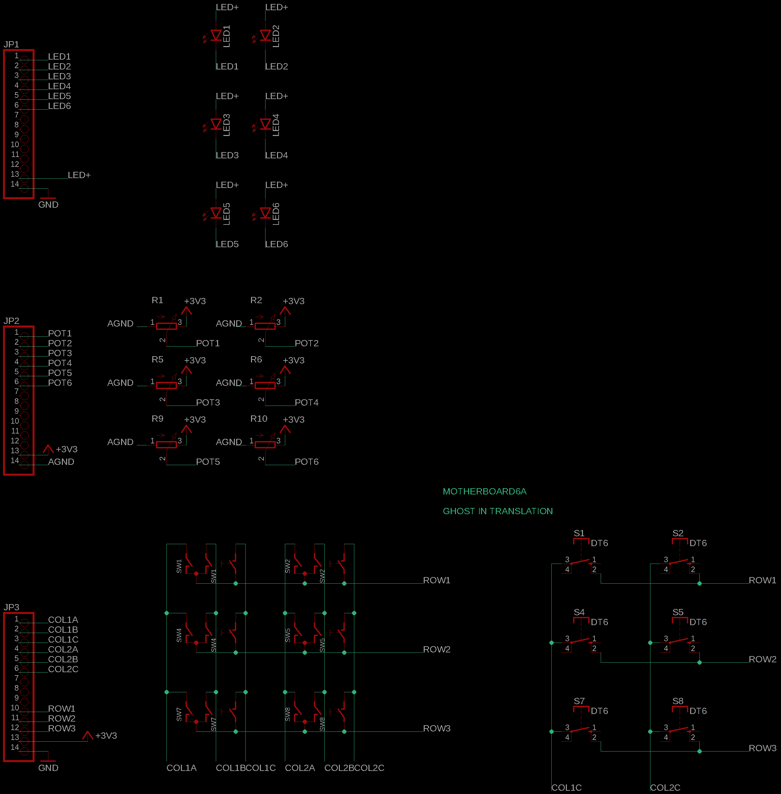
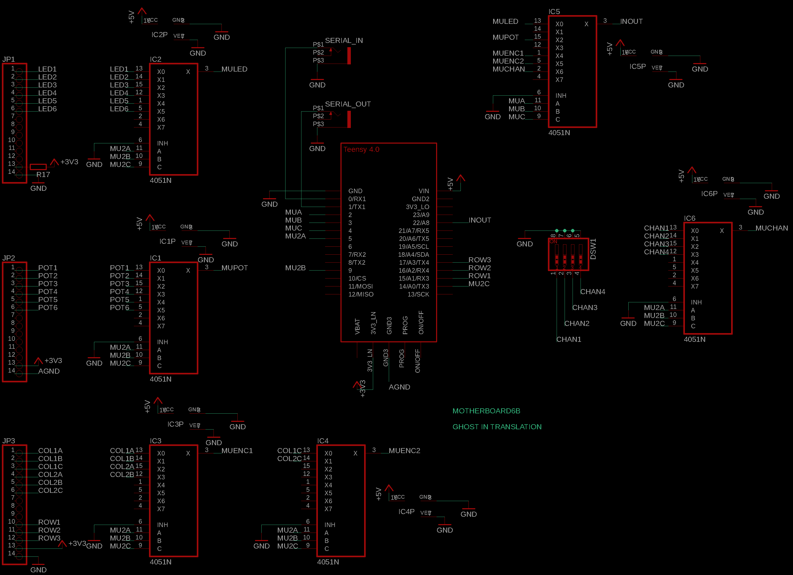

# MOTHERBOARD6
MOTHERBOARD6 is a 6 controls Teensy 4.0 + audio board platform.

MOTHERBOARD6, MOTHERBOARD9 and MOTHERBOARD12 allows for any combination of pushbuttons, potentiometers and encoders, in addition to leds. The footprints of those 3 type of components are stacked together so that only one pcb can be used for many different modules.

The MOTHERBOARDs come with 2 boards, one on which the inputs and leds are soldered to (A), and one on which the Teensy and other components are soldered to (B). Both boards are attached together by multiple pin headers.

NOTE: This is a work in progress.

## Schematics

Due to the use of the audio board, the available pins are very limited. Looking at the Teensy audio board page (https://www.pjrc.com/store/teensy3_audio.html) we can see only pins 0, 1, 2, 3, 4, 5, 9, 14, 16, 17, 22 are available. Also looking at Teensy pins (https://www.pjrc.com/store/teensy40.html), only 14, 16 and 17 from this subset are analog inputs.

So the use of multiplexers is required to be able to read pushbuttons, potentiometers, encoders or to lit leds. In addition, a matrix design is used for the encoders to reduce the number of inputs required as each of them has 3 inputs.

On this design, pin 22 will switch from input to output very fast to lit the leds and read the inputs.

 

### Notes

Dependng on the type of inputs used, not all multiplexers may be required. 

- IC1 = Mux for potentiometers
- IC2 = Mux for LEDs
- IC3 = Mux for encoders
- IC4 = Mux for encoder's switches and pushbuttons
- IC5 = Main mux, always required
- IC6 = Mux for midi channel dipswitch

A few examples:

If you only use potentiometers, you won't need IC3 and IC4. Or if you don't have any led you won't need IC2. Or if you don't want to use a dipswitch to select the midi channel, you won't need IC6.

## Teensy

In order to run any sketch on the Teensy you have to install the Teensyduino add-on to Arduino.
Follow the instructions from the official page:
https://www.pjrc.com/teensy/teensyduino.html

Then open the sketch located in the Motherboard6 folder of this repo.

In the Tools -> USB Type menu, choose "Serial + midi".

Then you are ready to compile and upload the sketch.

## Design rules

I made up design rules so that I can create many modules that will reuse the same back boards to lower the cost, and to make it look nice too. 

Some of the rules are:

* 1 column is 4HP width
* 1 column has up to 3 leds + 3 controls.

TODO: Design rules guide image.

## Known issues
- Encoders are not yet very reliable

## Historic 

Rev 3 (current) using more multiplexers because of the limited available pins.

Rev 2 added multiplexers, but wasn't taking in account the forbidden pins from the use of the audio board.

Rev 1 was using matrices for potentiometers, which doesn't work.

## About me
You can find me on Bandcamp and Instagram:

https://ghostintranslation.bandcamp.com/

https://www.instagram.com/ghostintranslation/

https://www.youtube.com/channel/UCcyUTGTM-hGLIz4194Inxyw

https://www.ghostintranslation.com/

## License

This project is licensed under the MIT License - see the [LICENSE.md](LICENSE.md) file for details